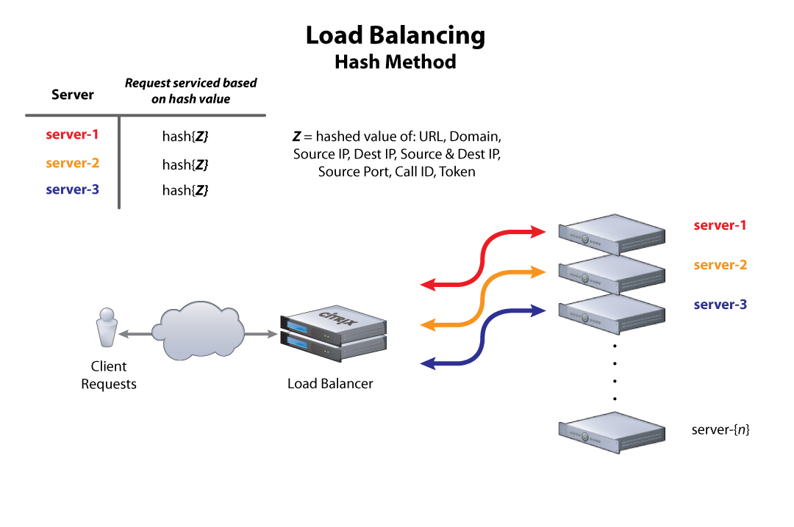

# Analisa apa perbedaan antara ketiga algoritma tersebut

Algoritma yang digunakan untuk loadbalancing ada 3, yakni :

- Round-Robin
- Least Connection
- IP Hash

Untuk mengatur konfigurasinya adalah :

Pertama, kami menjalankan script berikut :
  
    nano /etc/nginx/sites-available/default

Lalu, pada bagian ***upstream worker*** , tambahkan script berikut :

#### Round-Robin
Secara default, ALgoritma yang digunakan Nginx untuk loadbalancing adalah Round-Robin. Maka, tidak perlu menambahkan script apapun. Sehingga, bagian ***upstream worker*** menjadi :

    upstream worker {
      server 192.168.1.2;
      server 192.168.1.3;
    }
    
#### Least Connection
Saat ingin menggunakan Least Connection,  bagian ***upstream worker*** menjadi :

    upstream worker {
      least_conn;
      server 192.168.1.2;
      server 192.168.1.3;
    }
    
#### IP Hash
Saat ingin menggunakan IP Hash, bagian ***upstream worker*** menjadi :

    upstream worker {
      ip_hash;
      server 192.168.1.2;
      server 192.168.1.3;
    }
    
## HASIL ANALISA :

Berdasarkan praktik yang telah kami lakukan, perbedaan ketiganya terletak pada saat kita mengakses ipnya.
1. Round-Robin : Algoritma Round robin bekerja dengan cara membagi beban secara bergiliran dan berurutan dari satu server ke server lainnya. Konsep dasar dari algoritma Round robin ini adalah dengan menggunakan time sharing, pada intinya algoritma ini memproses antrian secara bergiliran
1. Least-Connection : Algoritma Least connection melakukan pembagian beban berdasarkan banyaknya koneksi yang sedang dilayani oleh sebuah server. Server dengan koneksi yang paling sedikit akan diberikan beban berikutnya, begitu pula server dengan koneksi banyak akan dialihkan bebannya ke server lain yang bebannya lebih rendah
1. IP Hash : Algoritma IP Hash adalah algoritma yang mengambil alamat IP sumber dan tujuan dari klien dan server untuk menghasilkan kunci hash yang unik. Kunci ini digunakan untuk mengalokasikan klien ke server tertentu. Karena kunci dapat diregenerasi jika sesi broken, metode load balancing ini dapat memastikan bahwa klien diarahkan ke server yang sama yang digunakan sebelumnya. Ini berguna jika penting bagi klien untuk harus terhubung ke sesi yang masih aktif setelah pemutusan dan koneksi ulang.
