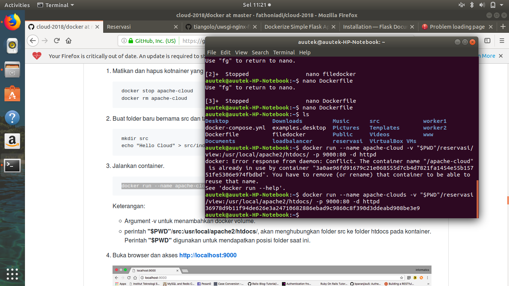

## Berikut langkah-langkahnya:
1. Mendownload file web yang telah disediakan [disini](https://cloud.fathoniadi.my.id/reservasi.zip)

buat file Dockerfile
     
     nano Dockerfile

jalankan perintah berikut :

    docker build -t flask-sample-one ./

