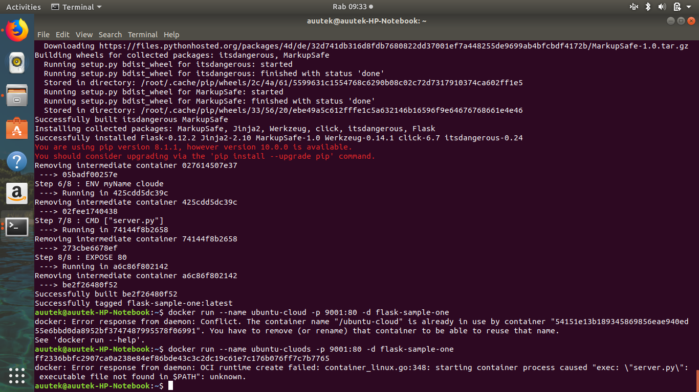

# ERROR/KENDALA

dalam pengerjaan tugas docker ini, kami mengalami beberapa kendala :

1. Koneksi WIFI yang buruk. Sehingga membuat kami terus menerus gagal ketika menginstal Flask dan lainnya.

Koneksi WiFi yang buruk menyebabkan beberapa kali kegagalan ketika menginstall. Sehingga proses terhambat.

2. Kebingungan dibagian WORKDIR pada Dockerfile

Kami bingung direktori mana yang harus kami tulis di Dockerfile sehingga beberapa kali kami mengalami kegagalan ketika akan menjalankan docker nya. seperti pada gambar di bawah ini.

