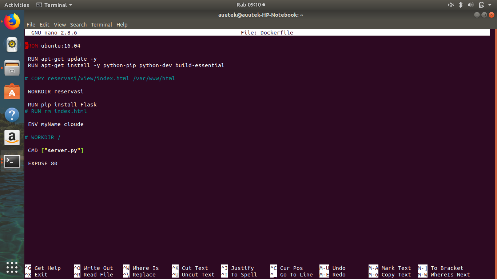
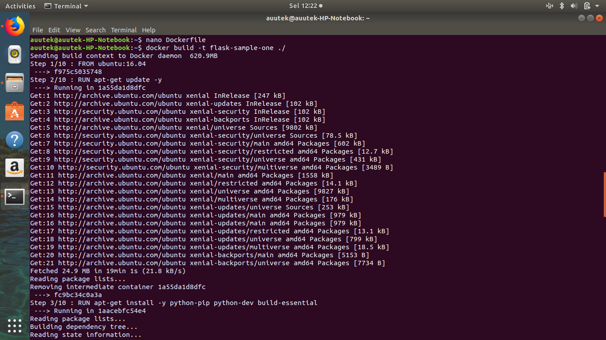
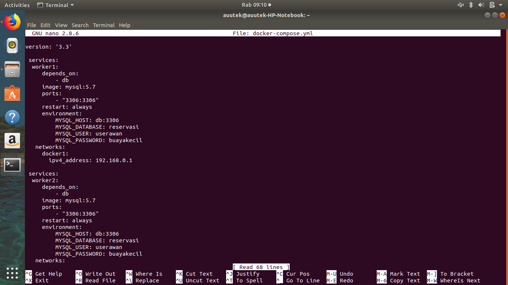
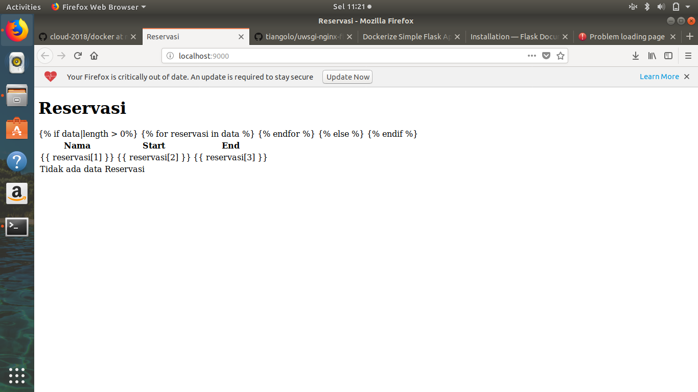

## Berikut langkah-langkahnya:
#### 1. Mendownload file web yang telah disediakan [disini](https://cloud.fathoniadi.my.id/reservasi.zip)

#### 2. Untuk menginstall aplikasi Flask dan pendukungnya,

buat file [Dockerfile](/Dockerfile)
     
     nano Dockerfile

jalankan perintah berikut :

    docker build -t flask-sample-one ./

setelah selesai, maka jalankan perintah berikut :

      docker run --name ubuntu-cloud -p 9001:80 -d flask-sample-one

### 3. Membuat 3 node yaitu worker1, worker2, dan worker3

Untuk membuat Langkah selanjutnya adalah membuat file [docker-compose.yml](/docker-compose.yml)

lalu jalankan perintah berikut :
     
     docker-compose up -d

Hasil mencoba pada browser:

